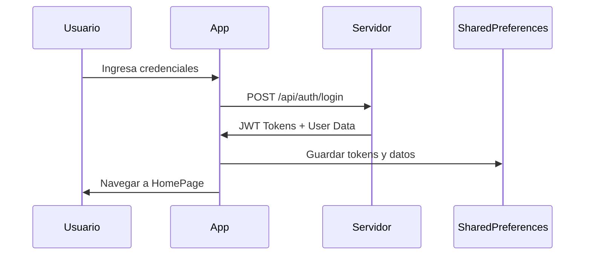

# 📚 Documentación Técnica - APP_MOVIL_BASE

## 🏗️ Arquitectura del Proyecto

### Patrón de Arquitectura
La aplicación sigue el patrón **MVVM (Model-View-ViewModel)** con elementos de **Clean Architecture**:

```
┌─────────────────────────────────────────────────────────────┐
│                    PRESENTATION LAYER                      │
├─────────────────────────────────────────────────────────────┤
│  Pages (Views)     │  Widgets     │  Providers (State)   │
├─────────────────────────────────────────────────────────────┤
│                    DOMAIN LAYER                            │
├─────────────────────────────────────────────────────────────┤
│  Services (API)    │  Models      │  Utils               │
├─────────────────────────────────────────────────────────────┤
│                    DATA LAYER                              │
├─────────────────────────────────────────────────────────────┤
│  SharedPreferences │  HTTP Client │  Local Storage       │
└─────────────────────────────────────────────────────────────┘
```

### Estructura de Directorios Detallada

```
lib/
├── config/                          # Configuraciones globales
│   └── api_config.dart             # Configuración de endpoints
├── main.dart                       # Punto de entrada de la app
├── models/                         # Modelos de datos
│   ├── rendimiento_grupal.dart     # Modelo para rendimientos grupales
│   └── rendimiento_individual.dart # Modelo para rendimientos individuales
├── pages/                          # Páginas principales
│   ├── home_page.dart             # Página principal con navegación
│   ├── login_page.dart            # Página de autenticación
│   ├── cambiar_clave_page.dart    # Cambio de contraseña
│   └── cambiar_sucursal_page.dart # Selección de sucursal
├── providers/                      # Gestión de estado
│   └── theme_provider.dart        # Provider para temas
├── services/                       # Servicios de API
│   ├── api_service.dart           # Servicio principal de API
│   └── login_services.dart        # Servicios de autenticación
├── theme/                          # Temas y estilos
│   └── app_theme.dart             # Configuración de temas
├── utils/                          # Utilidades
│   └── colors.dart                # Paleta de colores
└── widgets/                        # Widgets reutilizables
    ├── layout/
    │   └── app_bar.dart           # AppBar personalizado
    └── token_checker.dart         # Verificador de tokens
```

## 🔐 Sistema de Autenticación

### Flujo de Autenticación



### Gestión de Tokens

```dart
// Almacenamiento de tokens
await prefs.setString('access_token', token);
await prefs.setString('refresh_token', refreshToken);

// Renovación automática
if (tokenExpirado) {
  final nuevoToken = await refreshToken();
  if (nuevoToken) {
    // Continuar con la operación
  } else {
    // Redirigir al login
  }
}
```

### Variables de Entorno (SharedPreferences)

| Clave | Descripción | Ejemplo |
|-------|-------------|---------|
| `access_token` | Token de acceso JWT | `eyJhbGciOiJIUzI1NiIs...` |
| `refresh_token` | Token de renovación | `eyJhbGciOiJIUzI1NiIs...` |
| `user_name` | Nombre del usuario | `Miguel Bravo` |
| `user_sucursal` | Sucursal activa | `Santa Victoria` |
| `id_sucursal` | ID de sucursal | `1` |
| `id_rol` | ID del rol | `3` |
| `id_perfil` | ID del perfil | `1` |

## 🌐 Servicios de API

### AuthService
```dart
class AuthService {
  final String baseUrl = 'http://192.168.1.37:5000/api';
  
  Future<void> login(String usuario, String clave) async
  Future<bool> refreshToken() async
}
```

### ApiService
```dart
class ApiService {
  Future<List<Map<String, dynamic>>> getSucursales() async
  Future<bool> actualizarSucursalActiva(String idSucursal) async
}
```

### Endpoints Principales

#### Autenticación
```http
POST /api/auth/login
Content-Type: application/json

{
  "usuario": "mbravo",
  "clave": "password123"
}
```

**Respuesta:**
```json
{
  "access_token": "eyJhbGciOiJIUzI1NiIs...",
  "refresh_token": "eyJhbGciOiJIUzI1NiIs...",
  "nombre": "Miguel",
  "apellido_paterno": "Bravo",
  "apellido_materno": "Torres",
  "id_sucursal": 1,
  "sucursal_nombre": "Santa Victoria",
  "id_rol": 3,
  "id_perfil": 1
}
```

#### Sucursales
```http
GET /api/sucursales
Authorization: Bearer {access_token}
```

**Respuesta:**
```json
[
  {
    "id": 1,
    "nombre": "Santa Victoria"
  },
  {
    "id": 2,
    "nombre": "Sucursal Norte"
  }
]
```

## 🎨 Sistema de Temas

### Configuración de Tema
```dart
class AppTheme {
  static ThemeData get lightTheme {
    return ThemeData(
      colorScheme: ColorScheme.fromSeed(
        seedColor: Colors.green,
        brightness: Brightness.light,
      ),
      useMaterial3: true,
    );
  }
}
```

### Paleta de Colores
```dart
class AppColors {
  static const Color primary = Color(0xFF4CAF50);
  static const Color secondary = Color(0xFF2196F3);
  static const Color error = Color(0xFFF44336);
  static const Color warning = Color(0xFFFF9800);
  static const Color success = Color(0xFF4CAF50);
}
```

## 📱 Páginas Principales

### HomePage
- **Propósito**: Página principal con navegación
- **Características**:
  - Bottom navigation bar
  - Drawer lateral
  - AppBar personalizado
  - Gestión de estado de carga
  - Cambio de sucursal

### LoginPage
- **Propósito**: Autenticación de usuarios
- **Características**:
  - Validación de formularios
  - Animaciones de entrada
  - Manejo de errores
  - Redirección automática

## 🔧 Configuración de Desarrollo

### Variables de Entorno
```dart
// lib/services/login_services.dart
final String baseUrl = 'http://192.168.1.37:5000/api';
```

### Logs de Debug
```dart
// Sistema de logging condicional
void logDebug(String message) {
  if (kDebugMode) {
    print(message);
  }
}

void logInfo(String message) {
  if (kDebugMode) {
    print("ℹ️ $message");
  }
}

void logError(String message) {
  if (kDebugMode) {
    print("❌ $message");
  }
}
```

## 🧪 Testing

### Estructura de Tests
```
test/
├── unit/                    # Tests unitarios
│   ├── services/
│   └── models/
├── widget/                  # Tests de widgets
│   └── pages/
└── integration/             # Tests de integración
    └── app_test.dart
```

### Ejemplo de Test
```dart
import 'package:flutter_test/flutter_test.dart';
import 'package:app_lh_tarja/services/login_services.dart';

void main() {
  group('AuthService Tests', () {
    test('should login successfully with valid credentials', () async {
      final authService = AuthService();
      // Test implementation
    });
  });
}
```

## 📦 Build y Deploy

### Configuración de Build
```yaml
# pubspec.yaml
version: 1.0.0+1
```

### Comandos de Build
```bash
# Android APK
flutter build apk --release

# Android App Bundle
flutter build appbundle --release

# iOS
flutter build ios --release

# Web
flutter build web --release
```

### Configuración de Iconos
```yaml
# flutter_launcher_icons.yaml
flutter_launcher_icons:
  android: "launcher_icon"
  ios: true
  image_path: "assets/images/lh.jpg"
```

## 🚀 Optimizaciones

### Performance
- **Lazy Loading**: Carga diferida de widgets
- **Caching**: Almacenamiento local de datos
- **Image Optimization**: Optimización de imágenes
- **Memory Management**: Gestión eficiente de memoria

### Seguridad
- **Token Management**: Gestión segura de tokens
- **Data Encryption**: Encriptación de datos sensibles
- **Input Validation**: Validación de entrada
- **Error Handling**: Manejo seguro de errores

## 🔍 Debugging

### Herramientas de Debug
```dart
// Logs condicionales
logDebug("🔍 Datos del backend: $data");

// Verificación de tokens
if (kDebugMode) {
  print("Token: ${prefs.getString('access_token')}");
}
```

### Flutter Inspector
- Widget Inspector
- Performance Overlay
- Debug Paint
- Repaint Rainbow

## 📊 Métricas y Analytics

### Métricas de Performance
- **Startup Time**: Tiempo de inicio
- **Memory Usage**: Uso de memoria
- **Network Calls**: Llamadas a API
- **Error Rates**: Tasas de error

### Logs de Analytics
```dart
// Ejemplo de logging de eventos
void logEvent(String event, Map<String, dynamic> parameters) {
  if (kDebugMode) {
    print("📊 Event: $event, Params: $parameters");
  }
}
```

## 🔄 CI/CD

### GitHub Actions
```yaml
name: Flutter CI
on: [push, pull_request]
jobs:
  test:
    runs-on: ubuntu-latest
    steps:
      - uses: actions/checkout@v2
      - uses: subosito/flutter-action@v2
      - run: flutter test
      - run: flutter build apk
```

## 📚 Recursos Adicionales

### Documentación Flutter
- [Flutter Documentation](https://docs.flutter.dev/)
- [Material Design](https://material.io/design)
- [Dart Language](https://dart.dev/guides)

### Librerías Utilizadas
- [http](https://pub.dev/packages/http) - Cliente HTTP
- [shared_preferences](https://pub.dev/packages/shared_preferences) - Almacenamiento
- [provider](https://pub.dev/packages/provider) - Gestión de estado

---

**Última actualización**: Diciembre 2024  
**Versión de la documentación**: 1.0.0 