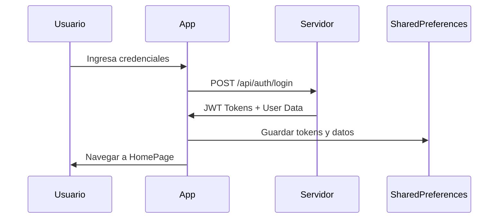

# 📚 Documentación Técnica - LH Tarjas

## 🏗️ Arquitectura del Proyecto

### Patrón de Arquitectura
La aplicación sigue el patrón **MVVM (Model-View-ViewModel)** con elementos de **Clean Architecture**:

```
┌─────────────────────────────────────────────────────────────┐
│                    PRESENTATION LAYER                      │
├─────────────────────────────────────────────────────────────┤
│  Pages (Views)     │  Widgets     │  Providers (State)   │
├─────────────────────────────────────────────────────────────┤
│                    DOMAIN LAYER                            │
├─────────────────────────────────────────────────────────────┤
│  Services (API)    │  Models      │  Utils               │
├─────────────────────────────────────────────────────────────┤
│                    DATA LAYER                              │
├─────────────────────────────────────────────────────────────┤
│  SharedPreferences │  HTTP Client │  Local Storage       │
└─────────────────────────────────────────────────────────────┘
```

### Estructura de Directorios Detallada

```
lib/
├── main.dart                       # Punto de entrada de la app
├── old_main.dart                   # Versión anterior del main
├── pages/                          # Páginas principales (44 archivos)
│   ├── home_page.dart             # Página principal con navegación
│   ├── login_page.dart            # Página de autenticación
│   ├── cambiar_clave_page.dart    # Cambio de contraseña
│   ├── cambiar_sucursal_page.dart # Selección de sucursal
│   ├── actividades_page.dart      # Gestión de actividades
│   ├── nueva_actividad_page.dart  # Crear nueva actividad
│   ├── editar_actividad_page.dart # Editar actividad existente
│   ├── actividades_multiples_page.dart # Actividades múltiples
│   ├── create_actividad_multiple_page.dart # Crear actividad múltiple
│   ├── editar_actividad_multiple_page.dart # Editar actividad múltiple
│   ├── rendimientos_page.dart     # Gestión de rendimientos
│   ├── crear_rendimiento_individual_page.dart # Crear rendimiento individual
│   ├── crear_rendimiento_grupal_page.dart # Crear rendimiento grupal
│   ├── crear_rendimiento_multiple_page.dart # Crear rendimiento múltiple
│   ├── editar_rendimientos_individuales_page.dart # Editar rendimientos individuales
│   ├── editar_rendimientos_grupales_page.dart # Editar rendimientos grupales
│   ├── editar_rendimiento_multiple_page.dart # Editar rendimiento múltiple
│   ├── indicadores_page.dart      # Página de indicadores
│   ├── horas_trabajadas_page.dart # Gestión de horas trabajadas
│   ├── usuarios_page.dart         # Gestión de usuarios
│   ├── nuevo_usuario_page.dart    # Crear nuevo usuario
│   ├── editar_usuario_page.dart   # Editar usuario existente
│   ├── trabajadores_page.dart     # Gestión de trabajadores
│   ├── nuevo_trabajador_page.dart # Crear nuevo trabajador
│   ├── editar_trabajador_page.dart # Editar trabajador existente
│   ├── contratistas_page.dart     # Gestión de contratistas
│   ├── nuevo_contratista_page.dart # Crear nuevo contratista
│   ├── editar_contratista_page.dart # Editar contratista existente
│   ├── colaboradores_page.dart    # Gestión de colaboradores
│   ├── nuevo_colaborador_page.dart # Crear nuevo colaborador
│   ├── editar_colaborador_page.dart # Editar colaborador existente
│   ├── permisos_page.dart         # Gestión de permisos
│   ├── nuevo_permiso_page.dart    # Crear nuevo permiso
│   ├── editar_permiso_page.dart   # Editar permiso existente
│   ├── info_page.dart             # Página de información
│   ├── ceco_riego_multiple.dart  # CECO de riego múltiple
│   ├── ceco_productivo_multiple.dart # CECO productivo múltiple
│   ├── ceco_riego_form.dart      # Formulario CECO riego
│   ├── ceco_productivo_form.dart # Formulario CECO productivo
│   ├── ceco_administrativo_form.dart # Formulario CECO administrativo
│   ├── ceco_maquinaria_form.dart # Formulario CECO maquinaria
│   └── ceco_inversion_form.dart  # Formulario CECO inversión
├── providers/                      # Gestión de estado
│   └── theme_provider.dart        # Provider para temas
├── services/                       # Servicios de API
│   ├── api_service.dart           # Servicio principal de API (4315 líneas)
│   └── login_services.dart        # Servicios de autenticación
├── theme/                          # Temas y estilos
│   └── app_theme.dart             # Configuración de temas
├── utils/                          # Utilidades
│   └── colors.dart                # Paleta de colores
└── widgets/                        # Widgets reutilizables
    ├── layout/
    │   └── app_bar.dart           # AppBar personalizado
    ├── old_token_checker.dart     # Verificador de tokens anterior
    └── token_checker.dart         # Verificador de tokens actual
```

## 🔐 Sistema de Autenticación

### Flujo de Autenticación



### Gestión de Tokens

```dart
// Almacenamiento de tokens
await prefs.setString('access_token', token);
await prefs.setString('refresh_token', refreshToken);

// Renovación automática
if (tokenExpirado) {
  final nuevoToken = await refreshToken();
  if (nuevoToken) {
    // Continuar con la operación
  } else {
    // Redirigir al login
  }
}
```

### Variables de Entorno (SharedPreferences)

| Clave | Descripción | Ejemplo |
|-------|-------------|---------|
| `access_token` | Token de acceso JWT | `eyJhbGciOiJIUzI1NiIs...` |
| `refresh_token` | Token de renovación | `eyJhbGciOiJIUzI1NiIs...` |
| `user_name` | Nombre del usuario | `Miguel Bravo` |
| `user_sucursal` | Sucursal activa | `Santa Victoria` |
| `id_sucursal` | ID de sucursal | `1` |
| `id_rol` | ID del rol | `3` |
| `id_perfil` | ID del perfil | `1` |

## 🌐 Servicios de API

### Configuración de Base URL
```dart
// lib/services/api_service.dart y lib/services/login_services.dart
final String baseUrl = 'https://apilhtarja-927498545444.us-central1.run.app/api';
// URL de desarrollo local comentada:
// final String baseUrl = 'http://192.168.1.52:5000/api';
```

### AuthService
```dart
class AuthService {
  final String baseUrl = 'https://apilhtarja-927498545444.us-central1.run.app/api';
  
  Future<void> login(String usuario, String clave) async
  Future<bool> refreshToken() async
}
```

### ApiService
```dart
class ApiService {
  // Gestión de actividades
  Future<List<dynamic>> getActividades() async
  Future<bool> createActividad(Map<String, dynamic> actividad) async
  Future<Map<String, dynamic>> editarActividad(String actividadId, Map<String, dynamic> datos) async
  Future<Map<String, dynamic>> editarActividadMultiple(dynamic actividadId, Map<String, dynamic> datos) async
  Future<bool> eliminarActividad(String actividadId) async
  
  // Gestión de rendimientos
  Future<Map<String, dynamic>> getRendimientos({String? idActividad}) async
  Future<bool> createRendimientos(List<Map<String, dynamic>> rendimientos) async
  Future<bool> editarRendimiento(String id, Map<String, dynamic> rendimiento) async
  Future<bool> eliminarRendimiento(String id) async
  
  // Rendimientos individuales
  Future<List<dynamic>> getRendimientosIndividualesPropios({String? idActividad}) async
  Future<List<dynamic>> getRendimientosIndividualesContratistas({String? idActividad, String? idContratista}) async
  Future<bool> crearRendimientoIndividualPropio(Map<String, dynamic> rendimiento) async
  Future<bool> crearRendimientoIndividualContratista(Map<String, dynamic> rendimiento) async
  
  // Gestión de usuarios y sucursales
  Future<String?> getSucursalActiva() async
  Future<bool> actualizarSucursalActiva(String nuevaSucursalId) async
  Future<Map<String, dynamic>> cambiarClave(String claveActual, String nuevaClave) async
  Future<List<Map<String, dynamic>>> getSucursales() async
  
  // Gestión de opciones y CECOs
  Future<List<Map<String, dynamic>>> getEspecies() async
  Future<List<Map<String, dynamic>>> getVariedades(String idEspecie, String idSucursal) async
  Future<List<Map<String, dynamic>>> getCecos(String idEspecie, String idVariedad, String idSucursal) async
  Future<List<Map<String, dynamic>>> getLabores() async
  Future<List<Map<String, dynamic>>> getUnidades() async
  Future<List<Map<String, dynamic>>> getTipoTrabajadores() async
  Future<List<Map<String, dynamic>>> getPorcentajes() async
  
  // Gestión de contratistas
  Future<List<Map<String, dynamic>>> getContratistas(String idSucursal) async
  Future<List<Map<String, dynamic>>> getContratistasPorSucursal() async
  Future<bool> crearContratista(Map<String, dynamic> contratistaData) async
  Future<Map<String, dynamic>> updateContratista(String id, Map<String, dynamic> contratistaData) async
  
  // Gestión de trabajadores
  Future<List<dynamic>> getTrabajadores(String idSucursal, String idContratista) async
  Future<List<Map<String, dynamic>>> getTrabajadoresPorSucursal() async
  Future<bool> crearTrabajador(Map<String, dynamic> data) async
  Future<bool> editarTrabajador(String id, Map<String, dynamic> data) async
  
  // Gestión de colaboradores y permisos
  Future<List<Map<String, dynamic>>> getColaboradores() async
  Future<Map<String, dynamic>> crearColaborador(Map<String, dynamic> data) async
  Future<Map<String, dynamic>> editarColaborador(String id, Map<String, dynamic> data) async
  Future<List<Map<String, dynamic>>> getPermisos() async
  Future<Map<String, dynamic>> crearPermiso(Map<String, dynamic> data) async
  Future<Map<String, dynamic>> editarPermiso(int id, Map<String, dynamic> data) async
  Future<bool> eliminarPermiso(String id) async
  
  // CECOs especializados
  Future<List<Map<String, dynamic>>> getCecosAdministrativos() async
  Future<List<Map<String, dynamic>>> getCecosProductivos() async
  Future<List<Map<String, dynamic>>> getCecosMaquinaria() async
  Future<List<Map<String, dynamic>>> getCecosInversion() async
  Future<List<Map<String, dynamic>>> getCecosRiego() async
  
  // CECOs por actividad
  Future<List<Map<String, dynamic>>> getCecosProductivosPorActividad(String idActividad) async
  Future<List<Map<String, dynamic>>> getCecosRiegoPorActividad(String idActividad) async
  Future<List<Map<String, dynamic>>> getCecosProductivosPorCuartel(String idActividad, String idCuartel) async
  
  // Gestión de riego
  Future<List<Map<String, dynamic>>> getCasetasPorActividad(String idActividad) async
  Future<List<Map<String, dynamic>>> getEquiposRiegoPorActividad(String idActividad) async
  Future<List<Map<String, dynamic>>> getSectoresRiego() async
  Future<List<Map<String, dynamic>>> getSectoresRiegoPorActividad(String idActividad) async
  
  // Gestión de inversiones
  Future<List<Map<String, dynamic>>> getTiposInversion() async
  Future<List<Map<String, dynamic>>> getInversionesPorTipo(int idTipoInversion) async
  Future<List<Map<String, dynamic>>> getTiposInversionPorActividad(String idActividad) async
  Future<List<Map<String, dynamic>>> getInversionesPorActividadYTipo(String idActividad, String idTipoInversion) async
  
  // Gestión de maquinaria
  Future<List<Map<String, dynamic>>> getTiposMaquinaria(String idActividad) async
  Future<List<Map<String, dynamic>>> getMaquinariasPorTipo(String idActividad, int idTipoMaquinaria) async
  
  // Gestión de cuarteles
  Future<List<Map<String, dynamic>>> getCuartelesPorActividad(String idActividad) async
  Future<List<Map<String, dynamic>>> getCuartelesPorActividadYVariedad(String idActividad, String idEspecie, String idVariedad) async
  
  // Utilidades y helpers
  Future<String?> getToken() async
  Future<String?> getRefreshToken() async
  Future<Map<String, String>> _getHeaders() async
  Future<void> manejarTokenExpirado() async
  Future<bool> verificarTokenAlInicio() async
  Future<bool> verificarTokenValido() async
  Future<void> cerrarSesion() async
}
```

### Endpoints Principales

#### Autenticación
```http
POST /api/auth/login
Content-Type: application/json

{
  "usuario": "mbravo",
  "clave": "password123"
}
```

**Respuesta:**
```json
{
  "access_token": "eyJhbGciOiJIUzI1NiIs...",
  "refresh_token": "eyJhbGciOiJIUzI1NiIs...",
  "nombre": "Miguel",
  "apellido_paterno": "Bravo",
  "apellido_materno": "Torres",
  "id_sucursal": 1,
  "sucursal_nombre": "Santa Victoria",
  "id_rol": 3,
  "id_perfil": 1
}
```

#### Renovación de Token
```http
POST /api/auth/refresh
Authorization: Bearer {refresh_token}
```

#### Actividades
```http
GET /api/actividades/
POST /api/actividades/
PUT /api/actividades/{id}
DELETE /api/actividades/{id}

GET /api/actividades_multiples/
POST /api/actividades_multiples/
PUT /api/actividades_multiples/{id}
```

#### Rendimientos
```http
GET /api/rendimientos/{idActividad}
POST /api/rendimientos/
PUT /api/rendimientos/{id}
DELETE /api/rendimientos/{id}

GET /api/rendimientos/individual/propio
POST /api/rendimientos/individual/propio
PUT /api/rendimientos/individual/propio/{id}
DELETE /api/rendimientos/individual/propio/{id}

GET /api/rendimientos/individual/contratista
POST /api/rendimientos/individual/contratista
PUT /api/rendimientos/individual/contratista/{id}
DELETE /api/rendimientos/individual/contratista/{id}

POST /api/rendimientos/grupal
```

#### Usuarios y Sucursales
```http
GET /api/usuarios/
POST /api/usuarios/
PUT /api/usuarios/{id}
GET /api/usuarios/sucursal-activa
POST /api/usuarios/sucursal-activa

GET /api/opciones/sucursales
```

#### Opciones y CECOs
```http
GET /api/opciones/
GET /api/opciones/especies
GET /api/opciones/variedades
GET /api/opciones/cecos
GET /api/opciones/labores
GET /api/opciones/unidades
GET /api/opciones/tipotrabajadores
GET /api/opciones/porcentajes
GET /api/opciones/porcentajescontratista
GET /api/opciones/tiporendimientos
GET /api/opciones/tiposceco

GET /api/opciones/cecos/administrativos
GET /api/opciones/cecos/productivos
GET /api/opciones/cecos/maquinaria
GET /api/opciones/cecos/inversion
GET /api/opciones/cecos/riego

POST /api/opciones/cecosadministrativos
POST /api/opciones/cecosproductivos
POST /api/opciones/cecosmaquinaria
POST /api/opciones/cecosinversion
POST /api/opciones/cecosriego
```

#### Contratistas y Trabajadores
```http
GET /api/contratistas/
POST /api/contratistas/
PUT /api/contratistas/{id}

GET /api/trabajadores
POST /api/trabajadores/
PUT /api/trabajadores/{id}
```

#### Colaboradores y Permisos
```http
GET /api/colaboradores/
POST /api/colaboradores/
PUT /api/colaboradores/{id}

GET /api/permisos/
POST /api/permisos/
PUT /api/permisos/{id}
DELETE /api/permisos/{id}
GET /api/permisos/tipos
```

#### Cambio de Clave
```http
POST /api/auth/cambiar-clave
Authorization: Bearer {access_token}

{
  "clave_actual": "password123",
  "nueva_clave": "newpassword456"
}
```

## 🎨 Sistema de Temas

### Configuración de Tema
```dart
class AppTheme {
  static ThemeData get lightTheme {
    return ThemeData(
      colorScheme: ColorScheme.fromSeed(
        seedColor: Colors.green,
        brightness: Brightness.light,
      ),
      useMaterial3: true,
    );
  }
}
```

### Paleta de Colores
```dart
class AppColors {
  static const Color primary = Color(0xFF4CAF50);
  static const Color secondary = Color(0xFF2196F3);
  static const Color error = Color(0xFFF44336);
  static const Color warning = Color(0xFFFF9800);
  static const Color success = Color(0xFF4CAF50);
}
```

## 📱 Páginas Principales

### HomePage
- **Propósito**: Página principal con navegación
- **Características**:
  - Bottom navigation bar con 4 pestañas principales
  - Drawer lateral con opciones de usuario
  - AppBar personalizado
  - Gestión de estado de carga
  - Cambio de sucursal
  - Navegación a todas las funcionalidades

### LoginPage
- **Propósito**: Autenticación de usuarios
- **Características**:
  - Validación de formularios
  - Animaciones de entrada
  - Manejo de errores
  - Redirección automática
  - Almacenamiento seguro de credenciales

### Actividades
- **actividades_page.dart**: Lista y gestión de actividades
- **nueva_actividad_page.dart**: Crear nueva actividad
- **editar_actividad_page.dart**: Editar actividad existente
- **actividades_multiples_page.dart**: Gestión de actividades múltiples

### Rendimientos
- **rendimientos_page.dart**: Vista general de rendimientos
- **crear_rendimiento_individual_page.dart**: Crear rendimiento individual
- **crear_rendimiento_grupal_page.dart**: Crear rendimiento grupal
- **crear_rendimiento_multiple_page.dart**: Crear rendimiento múltiple

### Gestión de Usuarios
- **usuarios_page.dart**: Lista de usuarios
- **nuevo_usuario_page.dart**: Crear nuevo usuario
- **editar_usuario_page.dart**: Editar usuario existente

### Gestión de Personal
- **trabajadores_page.dart**: Lista de trabajadores
- **contratistas_page.dart**: Lista de contratistas
- **colaboradores_page.dart**: Lista de colaboradores

### Configuración
- **cambiar_clave_page.dart**: Cambio de contraseña
- **cambiar_sucursal_page.dart**: Selección de sucursal
- **info_page.dart**: Información de la aplicación

## 🔧 Configuración de Desarrollo

### Variables de Entorno
```dart
// lib/services/login_services.dart y lib/services/api_service.dart
final String baseUrl = 'https://apilhtarja-927498545444.us-central1.run.app/api';
```

### Sistema de Logging
```dart
// Sistema de logging condicional optimizado para producción
void logDebug(String message) {
  // Comentado para mejorar rendimiento
  // print("🔍 $message");
}

void logInfo(String message) {
  // Comentado para mejorar rendimiento
  // print("ℹ️ $message");
}

void logError(String message) {
  // Solo mostrar errores críticos en producción
  // if (kDebugMode) {
  //   print("❌ $message");
  // }
}
```

### Gestión de Cache
```dart
// Cache en memoria para reducir llamadas a API
Map<String, bool>? _cacheIdsConRendimientos;
List<Map<String, dynamic>>? _cacheActividades;
DateTime? _cacheRendimientosAt;
DateTime? _cacheActividadesAt;
final Duration _cacheTTL = Duration(minutes: 2);
```

## 🧪 Testing

### Estructura de Tests
```
test/
├── widget_test.dart              # Test básico de widgets
└── ...                          # Tests adicionales
```

### Ejemplo de Test
```dart
import 'package:flutter_test/flutter_test.dart';
import 'package:app_lh_tarja/services/login_services.dart';

void main() {
  group('AuthService Tests', () {
    test('should login successfully with valid credentials', () async {
      final authService = AuthService();
      // Test implementation
    });
  });
}
```

## 📦 Build y Deploy

### Configuración de Build
```yaml
# pubspec.yaml
name: app_lh_tarja
description: "A new Flutter project."
version: 1.0.0+1
environment:
  sdk: '>=3.2.3 <4.0.0'
```

### Dependencias Principales
```yaml
dependencies:
  flutter: sdk: flutter
  http: ^1.1.0                    # Cliente HTTP
  shared_preferences: ^2.2.2      # Almacenamiento local
  dropdown_search: ^5.0.6         # Búsqueda con dropdown
  collection: ^1.18.0             # Utilidades de colecciones
  flutter_slidable: ^3.0.1        # Widgets deslizables
  cupertino_icons: ^1.0.2         # Iconos iOS
  intl: ^0.20.2                   # Internacionalización
  multi_select_flutter: ^4.1.3    # Selección múltiple
  provider: ^6.0.5                # Gestión de estado
  crypto: ^3.0.3                  # Encriptación

dev_dependencies:
  flutter_test: sdk: flutter
  flutter_launcher_icons: ^0.13.1 # Iconos de launcher
  flutter_lints: ^2.0.0           # Linting
```

### Comandos de Build
```bash
# Android APK
flutter build apk --release

# Android App Bundle
flutter build appbundle --release

# iOS
flutter build ios --release

# Web
flutter build web --release
```

### Configuración de Iconos
```yaml
# flutter_launcher_icons.yaml
flutter_launcher_icons:
  android: "launcher_icon"
  ios: true
  image_path: "assets/images/lh.jpg"
```

## 🚀 Optimizaciones

### Performance
- **Lazy Loading**: Carga diferida de widgets
- **Caching**: Almacenamiento local de datos con TTL de 2 minutos
- **Image Optimization**: Optimización de imágenes
- **Memory Management**: Gestión eficiente de memoria
- **Logging Condicional**: Logs deshabilitados en producción para mejor rendimiento

### Seguridad
- **Token Management**: Gestión segura de tokens JWT
- **Data Encryption**: Encriptación de datos sensibles
- **Input Validation**: Validación de entrada
- **Error Handling**: Manejo seguro de errores
- **HTTPS**: Uso de conexiones seguras en producción

### Manejo de Errores
```dart
// Manejo automático de tokens expirados
if (response.statusCode == 401) {
  await manejarTokenExpirado();
  throw Exception('Sesión expirada. Por favor, inicia sesión nuevamente.');
}

// Manejo de errores de conexión
if (e.toString().contains('SocketException') || 
    e.toString().contains('Connection refused') ||
    e.toString().contains('Network is unreachable')) {
  throw Exception('Error de conexión. Verifica tu conexión a internet.');
}
```

## 🔍 Debugging

### Herramientas de Debug
```dart
// Logs condicionales (habilitados solo en debug)
logDebug("🔍 Datos del backend: $data");

// Verificación de tokens
if (kDebugMode) {
  print("Token: ${prefs.getString('access_token')}");
}
```

### Flutter Inspector
- Widget Inspector
- Performance Overlay
- Debug Paint
- Repaint Rainbow

### Manejo de Errores de Red
```dart
// Verificación de respuestas HTML inesperadas
if (response.headers['content-type']?.toLowerCase().contains('text/html') == true) {
  logError("❌ Error: Respuesta HTML recibida cuando se esperaba JSON");
  throw Exception('Error de servidor: Se recibió HTML cuando se esperaba JSON');
}
```

## 📊 Métricas y Analytics

### Métricas de Performance
- **Startup Time**: Tiempo de inicio
- **Memory Usage**: Uso de memoria
- **Network Calls**: Llamadas a API con cache
- **Error Rates**: Tasas de error
- **Cache Hit Rate**: Efectividad del cache

### Logs de Analytics
```dart
// Ejemplo de logging de eventos
void logEvent(String event, Map<String, dynamic> parameters) {
  if (kDebugMode) {
    print("📊 Event: $event, Params: $parameters");
  }
}
```

## 🔄 CI/CD

### GitHub Actions
```yaml
name: Flutter CI
on: [push, pull_request]
jobs:
  test:
    runs-on: ubuntu-latest
    steps:
      - uses: actions/checkout@v2
      - uses: subosito/flutter-action@v2
      - run: flutter test
      - run: flutter build apk
```

## 📚 Recursos Adicionales

### Documentación Flutter
- [Flutter Documentation](https://docs.flutter.dev/)
- [Material Design](https://material.io/design)
- [Dart Language](https://dart.dev/guides)

### Librerías Utilizadas
- [http](https://pub.dev/packages/http) - Cliente HTTP
- [shared_preferences](https://pub.dev/packages/shared_preferences) - Almacenamiento
- [provider](https://pub.dev/packages/provider) - Gestión de estado
- [dropdown_search](https://pub.dev/packages/dropdown_search) - Búsqueda con dropdown
- [flutter_slidable](https://pub.dev/packages/flutter_slidable) - Widgets deslizables
- [multi_select_flutter](https://pub.dev/packages/multi_select_flutter) - Selección múltiple
- [crypto](https://pub.dev/packages/crypto) - Encriptación
- [intl](https://pub.dev/packages/intl) - Internacionalización

## 🔧 Funcionalidades Avanzadas

### Sistema de Cache Inteligente
- Cache en memoria con TTL configurable
- Invalidación automática al modificar datos
- Reducción de llamadas a API
- Mejora en rendimiento de la aplicación

### Gestión de Estados de Carga
- Indicadores de carga en todas las operaciones
- Manejo de estados de error
- Retry automático en fallos de red
- Feedback visual para el usuario

### Validación de Datos
- Validación en tiempo real de formularios
- Verificación de permisos por rol
- Sanitización de entrada de usuario
- Manejo de errores de validación

### Navegación Avanzada
- Navegación con drawer lateral
- Bottom navigation bar con 4 pestañas
- Navegación anidada
- Gestión de stack de navegación

---

**Última actualización**: Diciembre 2024  
**Versión de la documentación**: 2.0.0  
**Estado del proyecto**: En desarrollo activo con funcionalidades completas 